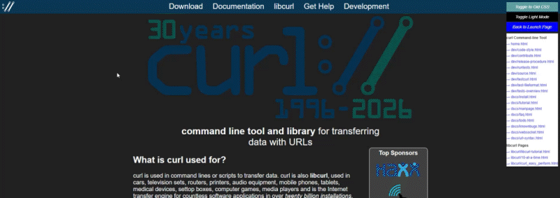

# Support Repo

<!-- Constants -->
Support branch of repository for:
<!-- Link to PR -->
- [curl-www pull request 576](https://github.com/curl/curl-www/pull/576)
- `Ctrl + click` View illustration [index.html](https://jhauga.github.io/support-repo/)
<!-- git commit -m "undeploy: use htmlpreview for index.html" -->
<!--
- `Ctrl + click` Navigate new pages [index.html](https://jhauga.github.io/htmlpreview.github.com/?https://raw.githubusercontent.com/jhauga/support-repo/refs/heads/BRANCH_NAME/index.html)
-->

## Toggle Changes

See the new `curl.css` compared to the old style, and render in light/dark mode.

