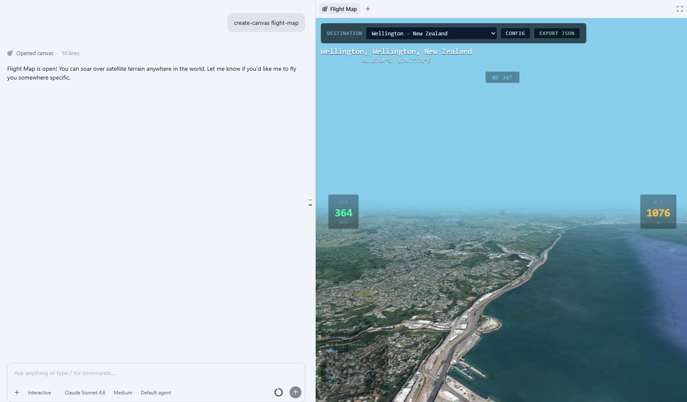

# Support Repo

<!-- Constants -->
Support branch of repository for:
<!-- Link to PR -->
- [awesome-copilot pull request](https://github.com/) <!-- github.com/<owner>/<repo>/pull/<[0-9]+> -->

<!-- NOTE - leave formatter_1 and formatter_2 for semi-automated task -->
<!-- formatter_1 -->
Support branch for new extension flight-map.

- **Agent**: Interactive
- **Model**: Claude Sonnet 4.6
- **Number of Prompts**: 1
- **Post Edits**: Screenshot

### Prompt

```bash
create-canvas flight-map
```

### Results

See screenshot below:


<!-- formatter_2 -->