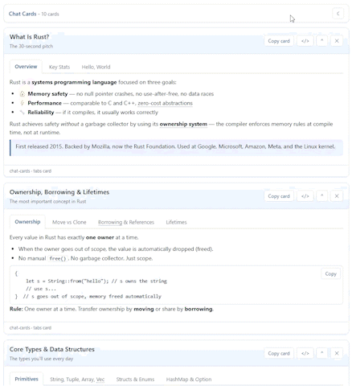

# Support Repo

<!-- Constants -->
Support branch of repository for:
<!-- Link to PR -->
- [awesome-copilot pull request](https://github.com/)

<!-- NOTE - leave formatter_1 and formatter_2 for semi-automated task -->
<!-- formatter_1 -->
Support branch for new canvas extension `chat-cards`.

- **Agent**: Interactive
- **Model**: Claude Sonnet 4.6
- **Number of Prompts**: 1
- **Post Edits**: None

### Prompt

```text
I need help with learning the programming language RUST. I want get get a
solid understanding of the language's base. Learn enough to apply the 80/20
rule of producing functional applications from learning the language, and when
to use it vs. when to use other languages. Use chat-cards to help out
```

### Results


<!-- formatter_2 -->