# Install Ender-3 V3 SE Hotend Kit

## Remove and Replace Broken Part from 3D Printer

#### 1. Remove the cover

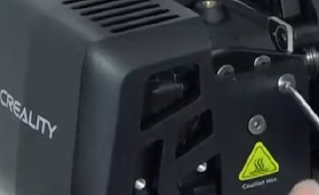

#### 2. Unplug wires, cutting wire caps

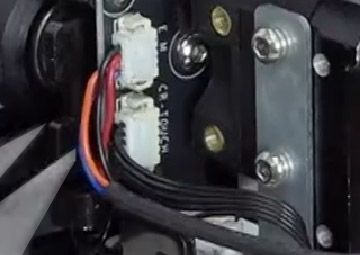

#### 3. Unscrew nozzle screws

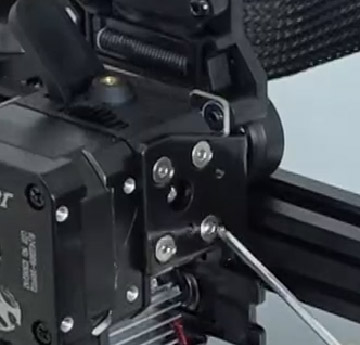

#### 4. Cut the remaining wire caps

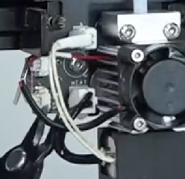

#### 5. Remove the nozzle mounting screws

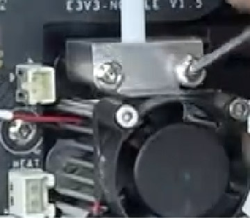

#### 6. Remove the fan

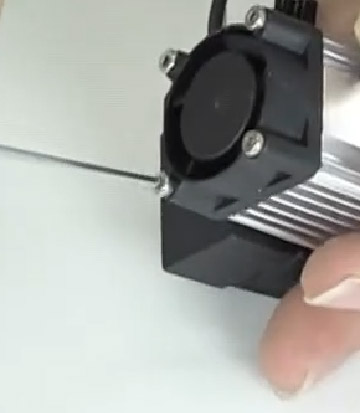

#### 7. Replace part

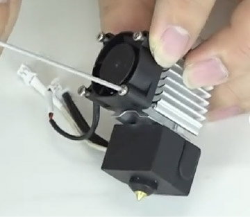

#### 8. Reconnect cover

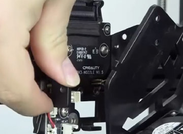

#### 9. Plug in wires

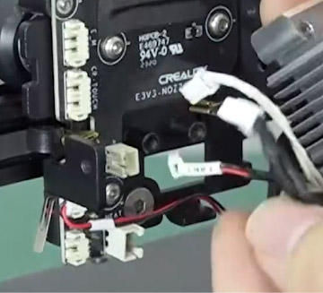

#### 10. Reconnect nozzle mounting screws

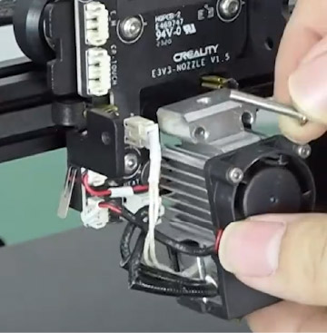

#### 11. Nozzle connected to printer

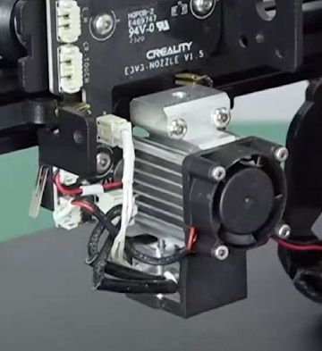

#### 12. Reattach ptfe tube

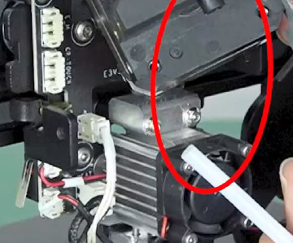

#### 13. Insert ptfe tube

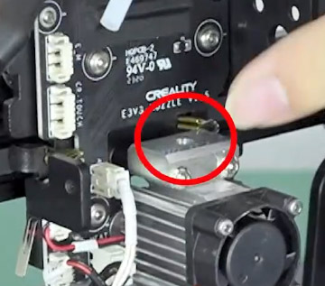

#### 14. Plug in all remaining wires

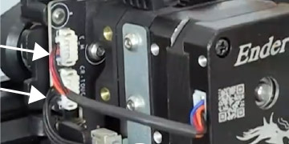

#### 15. Screw in nozzle side screws

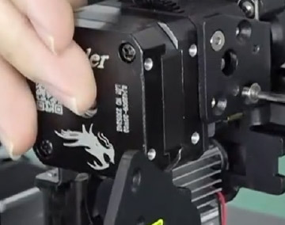

#### 16. Reattach cover

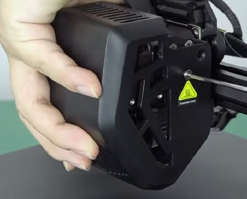